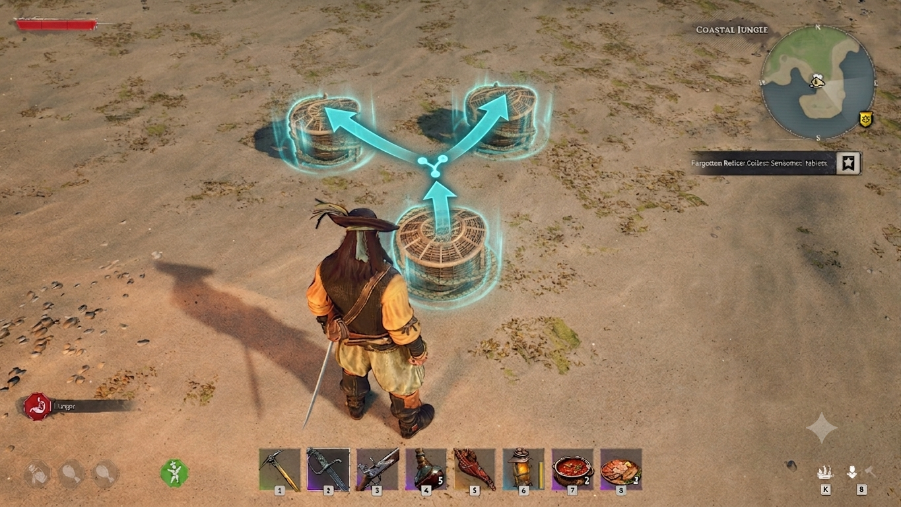

# CampDepositReloaded

A from-scratch, open reimplementation of [Skiprhax's Camp Deposit](https://www.nexusmods.com/windrose/mods/445) for [Windrose](https://store.steampowered.com/app/3041230/Windrose/), as a [UE4SS](https://github.com/UE4SS-RE/RE-UE4SS) Lua mod instead of a version-locked native DLL. The original appears unmaintained and hardcodes byte offsets for one exact game build, so it breaks on every update. This rewrite drives the same game logic through Unreal's reflection system instead, so it isn't tied to any specific build.



## What it does

Press Q (Deposit Similar) on one chest, and every other chest within range gets the same treatment - exactly as if you'd looked at each one and pressed Deposit Similar yourself.

It is **not** an auto-sorter: it doesn't choose categories or send items into empty chests. It only extends the game's own "move items whose type already exists in the target" logic to nearby chests.

## Features

- Extends vanilla Deposit Similar to every chest within a configurable radius
- Works in singleplayer, self-hosted co-op (Host Game/Listen server), and on a dedicated server
- **Server-side only** - like the original mod, nothing to install on clients if using on a dedicated server
- No new menu, no new hotkey - it rides the existing Deposit Similar action

## How it works

Deposit Similar reaches the server as a single call: `AbilitySystemComponent:ServerSetReplicatedTargetData`, replicated from the client as part of Windrose's Gameplay Ability System interact flow. The mod hooks that call _after_ it completes, so the player's own deposit always runs first and lands in the chest they actually meant.

The destination chest turns out to be resolved through the interact target component's owning actor, not through anything readable in the replicated payload itself (which is an opaque, game-specific struct with no reflected accessor). So for every other chest in range, the mod:

1. Temporarily points the origin chest's `InteractTargetComponent` owner at that chest
2. Re-fires the identical RPC call - the server re-resolves the destination through the (now lying) component and runs its own native deposit again
3. Restores the component **immediately**, and verifies the restore before moving on

Step 3 is per chest, not per fan-out, and the pointer is never left lying between frames. Anything else the engine processes in that window - another player's interaction, the game's own tick - would otherwise resolve its destination through it.

The owner pointer's byte offset isn't a fixed constant in the mod - it's discovered at runtime by scanning `UActorComponent`'s memory for a pointer back to the chest, so an offset shift on a future game update degrades to "the mod logs a warning and does nothing" rather than silently corrupting memory.

The origin chest itself is approximated as the chest nearest the depositing player, since the replicated payload doesn't expose it directly - true whenever the player deposits at point-blank range, which vanilla Deposit Similar always requires anyway.

### Knowing it is a Deposit Similar at all

`ServerSetReplicatedTargetData` is not a deposit call. It is the generic targeted-interact path: doors, windows, chest opens and looting all arrive through it, and an earlier version fanned out for every one of them - which is why doors and windows toggled once per nearby chest and closed again in your face.

The mod therefore identifies the interaction one step earlier. Windrose constructs an **interact option ability** for each interaction, and its class says which action it is:

| Interaction | Option class |
| ----------- | ------------ |
| Deposit Similar | `GA_InteractOption_DepositSimilar_C` |
| Door / window | `R5Ability_InteractOption_ToggleDoor` |
| Open or loot a chest | `GA_InteractWithObject_ExternalInvetory_C` |

That ability is constructed a couple of milliseconds before the RPC lands, and its outer object is the player's `BP_R5PlayerState_C` - the same object that owns the AbilitySystemComponent carrying the RPC, so the match is per player rather than global.

The mod captures the option and refuses to fan out unless it belongs to the same player, is recent, and is a deposit option. **It fails closed**: an interaction it cannot positively identify is one it does not touch. That is deliberate - a mod that quietly stops working is better than one that breaks your doors.

Two alternatives were measured and rejected rather than assumed: the RPC's own by-value parameters (ability handle, prediction key, `ApplicationTag`) come back from UE4SS as opaque `UScriptStruct` userdata with no readable fields, and `R5Ability_InteractOption_Base:GetTargetActor` is hookable but its return value reads back invalid. If a game update renames the deposit option class, the mod warns once in `UE4SS.log` and names the classes it did see, instead of going inert without explanation - fix by editing `depositOptionClasses`.

### Cost control

A fan-out is the most expensive thing this mod does, and it must never be able to stall a server frame:

- **One sweep per interaction.** Finding the origin and the candidates is a single pass over the loaded chests, not one pass each.
- **`chestsPerTick` per frame.** Replays are spread over frames, four by default, instead of one burst of sixteen native deposit passes.
- **`debounceSeconds` is stamped when a fan-out _starts_**, not when an interaction is seen, so the many interactions that reach the hook cannot consume the window a real Deposit Similar needs. This is what made a deposit straight after looting silently do nothing.
- **One fan-out at a time.** Interactions arriving mid-fan-out are rejected immediately, before any scanning. A fan-out whose frames never arrive is abandoned after five seconds rather than wedging the mod.

Targets are limited to the origin chest's own camp when the camp has a building centre (`campScoped`), because Deposit Similar is a per-container action and two camps can easily sit inside one radius; `radiusMeters` remains the fallback for chests with no building centre.

## Config

Settings live in `CampDepositReloaded.cfg.lua`, next to the installed `main.lua` (not tracked in git; `make install` links it if it exists):

```lua
return {
    enabled = true,
    radiusMeters = 48.0,
    maxAttempts = 16,
    chestsPerTick = 4,
    campScoped = true,
    interactRangeMeters = 6.0,
    debounceSeconds = 1.0,
    runtimeLogging = true,
    depositOptionClasses = {
        GA_InteractOption_DepositSimilar_C = true,
        R5Ability_InteractOption_DepositSimilar = true,
    },
    optionWindowSeconds = 1.0,
    failClosed = true,
    debug = false,
    replayMode = "unwrapped",
}
```

| Key                   | Default      | Meaning                                                                                     |
| ---------------------- | ------------ | ------------------------------------------------------------------------------------------- |
| `enabled`              | `true`       | Master on/off switch                                                                         |
| `radiusMeters`         | `48.0`       | Search radius for nearby chests (fallback when `campScoped` finds no building centre)        |
| `maxAttempts`          | `16`         | Cap on chests deposited into per Deposit Similar use                                         |
| `chestsPerTick`        | `4`          | Max replays per frame, so a fan-out cannot stall a frame                                     |
| `campScoped`           | `true`       | Limit targets to the origin chest's camp when it has a building centre                      |
| `interactRangeMeters`  | `6.0`        | Origin chest must be within this range of the player, or the deposit is ignored              |
| `debounceSeconds`      | `1.0`        | Backstop minimum gap between fan-outs per player; stamped only when a fan-out starts         |
| `depositOptionClasses` | see above    | Interact option classes that mean "this was a Deposit Similar"                               |
| `optionWindowSeconds`  | `1.0`        | How recent that option must be to count                                                       |
| `failClosed`           | `true`       | Refuse to act on an interaction that cannot be positively identified                          |
| `runtimeLogging`       | `true`       | Log activity to `UE4SS.log`                                                                  |
| `debug`                | `false`      | Verbose tracing, plus the interaction diagnostics described in [TESTING.md](TESTING.md)       |
| `replayMode`           | `"unwrapped"` | What the replayed RPC receives for its target-data handle: `unwrapped` (works) or `wrapper` (rejected by the engine) |

## Requirements

- [UE4SS (experimental-latest)](https://github.com/UE4SS-RE/RE-UE4SS/releases/tag/experimental-latest)

## Install

Install wherever the game's **authoritative server logic** actually runs. Not needed on clients.

- **Dedicated server:** install into that server's own `R5/Binaries/Win64/`.
- **Singleplayer:** install into your normal game install (`R5/Binaries/Win64/`) - the single process is its own authority.
- **Host Game (listen server via invite code):** hosting spins up a _separate_ `WindroseServer-Win64-Shipping.exe` process from `R5/Builds/WindowsServer/R5/Binaries/Win64/` - a self-hosted dedicated server running alongside your normal client. **That** is where the deposit is actually authoritative, not your visible game client. Install UE4SS and this mod into `R5/Builds/WindowsServer/R5/Binaries/Win64/` too (same steps below, different directory), or Host Game deposits will silently do nothing, since the mod never sees them.

### 1. Install UE4SS

Extract the `dwmapi.dll` and `ue4ss` folder to the `R5\Binaries\Win64` directory.

> **Linux tip:** Set your launch option to `WINEDLLOVERRIDES="dwmapi=n,b" %command%` to load UE4SS.

### 2. Configure UE4SS

Open `UE4SS-settings.ini` and update the `[EngineVersionOverride]` section:

```ini
[EngineVersionOverride]
MajorVersion = 5
MinorVersion = 6
```

### 3. Install the mod

Download the [latest release](https://github.com/SavageCore/CampDepositReloaded/releases/latest) and extract it to `R5/Binaries/Win64/ue4ss/Mods/`.

You should end up with:

```
ue4ss/Mods/CampDepositReloaded/
├── enabled.txt
└── Scripts/
    └── main.lua
```

## Development

### Prerequisites

- `make`
- A local Windrose installation (Linux/Steam or override path)

### Build & Install

Symlink the mod directly into your game's Mods folder:

```bash
make install
```

The default install path is:

```
~/.local/share/Steam/steamapps/common/Windrose/R5/Binaries/Win64/ue4ss/Mods
```

Override it for a custom location:

```bash
make install INSTALL_DIR=/path/to/ue4ss/Mods
```

To test Host Game locally, also install into the game's bundled server build (see [Install](#install)):

```bash
make install INSTALL_DIR="$HOME/.local/share/Steam/steamapps/common/Windrose/R5/Builds/WindowsServer/R5/Binaries/Win64/ue4ss/Mods"
```

Build only (output goes to `build/CampDepositReloaded/`):

```bash
make build
```

Run the test harness - stubs UE4SS and drives `main.lua` outside the game, asserting the identity gate, the per-replay owner-pointer restore, camp scoping and the stale-class warning:

```bash
make test
make test DEPOSIT_CLASSES_STALE=1   # simulate a game update renaming the option
```

Both run in CI alongside luacheck.

Linting is [luacheck](https://github.com/lunarmodules/luacheck), run in CI and as a [lefthook](https://lefthook.dev) pre-commit hook:

```sh
lefthook install
```
